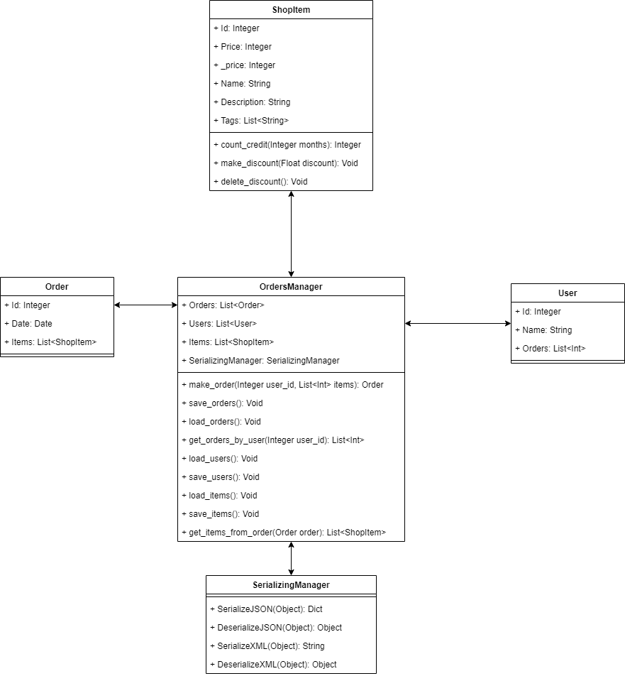
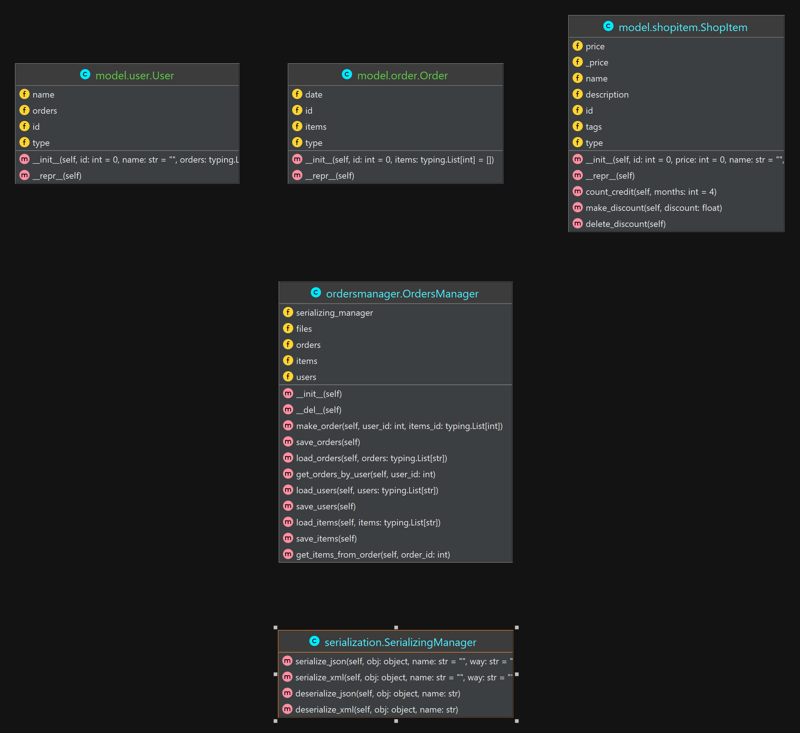

# Labs_AppProg
## Лабораторная работа по курсу *"Прикладное программирование"* **МГТУ СТАНКИН**.

### Условие

Напишите классы для предметной области магазина. Возможные классы: товар и услуга. В 4-м и 5-м пунктах хранение объектов одного класса реализовать в формате JSON, другого − в формате XML.

### ПрИкОлЮхИ

Сериализация и десерализация в данной лабе абсолютно универсальны. Они используют встроенные в питон средства языка, позволяющие легко получить названия и значения полей классов.
<code>object.__ dict __</code> возвращает словарь, где ключи - названия полей в формате строки, а значения - значения поля (тавтология, ну и ладно).
Так можно легко дампить в JSON или создать универсальный перебор для парса в XML, а также легко обратно десериализовывать.
К примеру, создать пустой экземпляр класса, затем распарсить данные из файла, и через этот словарь объекту назначить все данные, при этом в случае чего получить и обработать ошибки в случае несоответствия названий полей.

### UML (draw.io)

### UML (JetBrains built-in)

### Git log

Так как у меня в один момент случился конфликт веток локальных и удалённой, пришлось их порешать и на гитхабе слетела история коммитов, поэтому в доказательство, что всё не было своровано в последние пару дней скрин локального гит лога с основного компа

С ноута такой кидать лень :)
